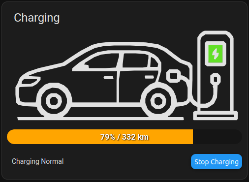

# simple-ev-card

This repository contains a small Home Assistant Lovelace custom card for the status of an EV and home Charger.




Status
-----------------
- **Under active development.** This project is not yet considered stable or generally reusable.
- **AI-assisted:** parts of this repository were created with the help of AI tools (ChatGPT and GitHub Copilot). AI was used to create images, scaffold files, suggest fixes, and refactor code — please review carefully before reuse.
- **Use-case specific:** the current implementation and configuration are tailored to a specific setup and entity names. You will likely need to adapt entity IDs, sensor names and possibly the calendar API path to your Home Assistant instance.

Where to look
-----------------
- `src/main.ts` — single-file card implementation (template injected in `setConfig()` and updates in `set hass(hass)`).

Installation
-----------------

Install via HACS (recommended)

1. In HACS (Home Assistant Community Store):
- Open HACS → Settings → Custom repositories.
- Add this GitHub repository and choose category `Frontend` (for Lovelace cards).
- After adding, go to HACS → Frontend (or the repository page) and click Install.

2. Add the card to a Lovelace view using the example config in `DEVELOPERS.md`.

Manual installation

1. Copy `dist/simple-ev-card.js` into your `www/` folder

2. Add the resource to Lovelace (Configuration → Dashboards → Resources):
- Use the resource path `/local/www/simple-ev-card.js`

Usage
-----------------
```yaml
type: 'custom:car-card'
car_charging_entity: switch.car_charger
car_battery_entity: sensor.car_battery
car_cruising_range_entity: sensor.car_range
# car_location_entity: device_tracker.my_car  # Optional if using is_home/is_driving/is_away
charger_connected_entity: binary_sensor.charger_connected
is_charging_entity: binary_sensor.car_is_charging
charger_status: sensor.charger_status
calendar: calendar.work
is_home: binary_sensor.car_is_home  # Optional, see below
is_driving: binary_sensor.car_is_driving  # Optional, see below
is_away: binary_sensor.car_is_away  # Optional, see below
```

## Example Lovelace YAML

### 1. Device tracker (legacy, fallback)
```yaml
type: 'custom:car-card'
car_charging_entity: switch.car_charger
car_battery_entity: sensor.car_battery
car_cruising_range_entity: sensor.car_range
car_location_entity: device_tracker.my_car  # Required if not using is_home/is_driving/is_away
charger_connected_entity: binary_sensor.charger_connected
is_charging_entity: binary_sensor.car_is_charging
charger_status: sensor.charger_status
calendar: calendar.work
```

### 2. Boolean sensors (when a device tracker is not available)
```yaml
type: 'custom:car-card'
car_charging_entity: switch.car_charger
car_battery_entity: sensor.car_battery
car_cruising_range_entity: sensor.car_range

charger_connected_entity: binary_sensor.charger_connected
is_charging_entity: binary_sensor.car_is_charging
charger_status: sensor.charger_status
calendar: calendar.work
is_home: binary_sensor.car_is_home
is_driving: binary_sensor.car_is_driving
is_away: binary_sensor.car_is_away
```


Feedback and contributions are welcome — please open issues or PRs.
